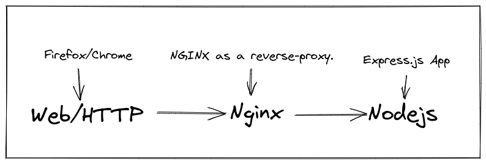

This is a [Next.js](https://nextjs.org/) project bootstrapped with [`create-next-app`](https://github.com/vercel/next.js/tree/canary/packages/create-next-app).



#### Dependencies
- Nodejs
- Nginx
- Docker
- Docker-compose
- gray-matter
- next
- react
- react-dom
- react-icons
- react-markdown
- react-wavify
- sharp
#### 1. Clone the soure repository.
```bash
https://github.com/micrometre/website.git
```
##### 2. Change to the cloned repository.
```bash
cd express
```
##### 3. Install node dependencies
```bash
npm i
```
```bash
npm run dev
```
Acsess
- website/app via http://localhost:3000

####  Run the Production server in docker

**Step 1**: Clone  repo
```bash
 git clone https://github.com/micrometreuk/express
```

**Step 2**: Move into the directory start the docker containers
```bash
make start
```

Acsess
- website/app via http://localhost:9998

**Step 3**: To uninstall run

```bash
make remove
```

## Deploy on Vercel

The easiest way to deploy your Next.js app is to use the [Vercel Platform](https://vercel.com/new?utm_medium=default-template&filter=next.js&utm_source=create-next-app&utm_campaign=create-next-app-readme) from the creators of Next.js.

Check out our [Next.js deployment documentation](https://nextjs.org/docs/deployment) for more details.
